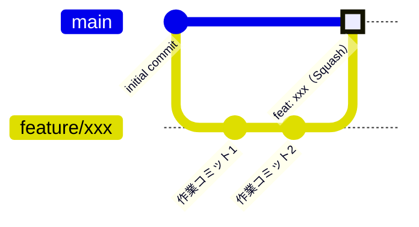

# ブランチ戦略

## mainブランチ

- 直接pushは禁止（ブランチ保護ルールで強制）
- 全変更はPRを通じてSquash Mergeのみ受け付ける
- マージ後は作業ブランチを自動削除

## 作業ブランチ命名規則

| prefix | 用途 |
|--------|------|
| `feature/` | 新機能 |
| `fix/` | バグ修正 |
| `refactor/` | リファクタリング |
| `docs/` | ドキュメント |
| `chore/` | 雑務・設定変更 |

例: `feature/login-screen`, `fix/crash-on-startup`

## PRルール

- タイトルはConventional Commitsに準拠（Squash後のコミットメッセージになる）
  - 例: `feat: ログイン画面を追加`, `fix: 起動時クラッシュを修正`
- 日本語で記述

## フロー

